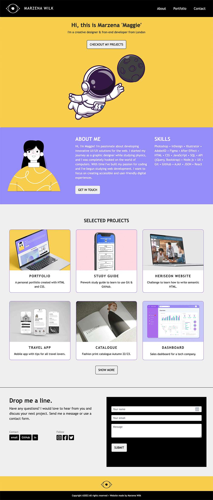

# Portfolio using Bootstrap

## Description 

> Challege3 I was recreating my first portfolio website from challenge 2 using bootstrap. The task was to get used to contet delivery networks and learn to use built-in column media queries to buils responsive layouts.  

## Usage 

* Deployed application - [https://marzena-w.github.io/portfolio-bootstrap/]
* Screenshot of the portfolio:

## Credits

* For more information about bootstrap elelemnt
W3 - [https://www.w3schools.com/bootstrap4/default.asp]

* To see website updates while making changes to the code
Live Server - [https://marketplace.visualstudio.com/items?itemName=ritwickdey.LiveServer]

* Bootstrap - [https://getbootstrap.com/docs/4.6/getting-started/introduction/]

* For aditional info about bootstrap - [https://stackoverflow.com/]

## License

MIT
